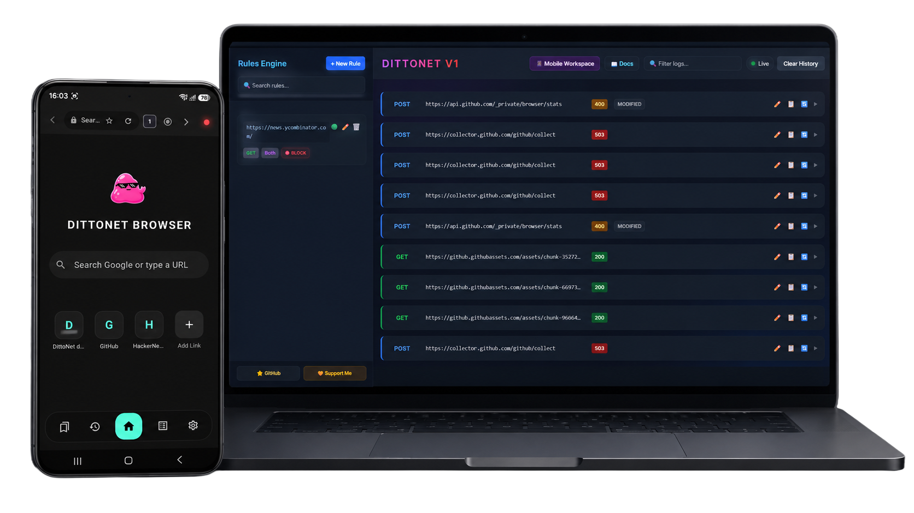
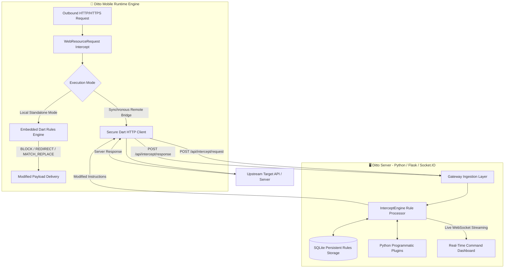

<p align="center">
  
</p>

<h1 align="center">⚡ DittoNet Core Infrastructure ⚡</h1>

<p align="center">
  <strong>A High-Throughput Transparent Proxy Bridge, Programmable Reverse Engineering Engine, & W3C HAR Telemetry Pipeline</strong><br>
  <em>Engineered in Flutter & Python for deterministic traffic interception, AST-aware payload mutation, runtime DOM hooking, and WebSocket command orchestration.</em>
</p>

<p align="center">
  
  
  
  
</p>

<p align="center">
  <a href="https://github.com/MassoudiR/DittoNet/releases/latest">
    
  </a>
  <a href="https://github.com/MassoudiR/DittoNet/releases">
    
  </a>
  <a href="https://github.com/MassoudiR/DittoNet/stargazers">
    
  </a>
</p>

<p align="center">
  
</p>

---

## 🏛️ Executive Engineering Overview

Modern Android application security research is fundamentally constrained by network isolation layers, strict SSL/TLS certificate pinning, and OS-level routing restrictions. Traditional desktop proxy suites (such as Burp Suite, OWASP ZAP, or Charles Proxy) require rooted physical devices, intrusive system certificates, or fragile `iptables` forwarding rules that modern applications actively evade.

**DittoNet** solves this bottleneck at the architectural level. By embedding a high-performance transparent interceptor bridge directly into a runtime rendering environment, DittoNet captures network transactions at the boundary between native Android `WebResourceRequest` calls and the upstream network execution layer.

Operating as a unified system between a **Mobile Interceptor Client (`Ditto Mobile`)** and a **Python Command Server (`Ditto Server`)**, DittoNet provides security engineers, reverse engineers, and backend developers with complete programmatic control over HTTP/HTTPS request and response lifecycles, real-time rule evaluation, and runtime DOM environments.

---

## ⚙️ Architectural Blueprint & Execution Lifecycle

DittoNet executes traffic interception through a dual-phase hybrid pipeline. Outbound requests and inbound responses are evaluated either locally on the device with zero network overhead, or forwarded via HTTP POST to the desktop server for remote rule processing. The server then streams live telemetry events to the dashboard over Socket.IO.



---

## ⚙️ Core Capabilities & Engineering Features

### 1. 🛡️ Deterministic Dual-Mode Interception Pipeline
DittoNet is engineered to operate seamlessly across two distinct network topologies:
* **Synchronous Remote Bridge**: Forwards full HTTP request headers, query parameters, and raw binary payloads to the dedicated desktop server (`/api/intercept/request`). Upstream server responses are intercepted prior to DOM rendering (`/api/intercept/response`), allowing real-time Python manipulation.
* **Standalone Zero-Latency Local Engine**: When operating offline or in high-speed environments, DittoNet evaluates persistent rules directly inside Dart memory without incurring network serialization latency.

### 2. ⚡ AST-Aware Traffic Mutation & Precedence Engine
The core interception engine applies strict, deterministic execution hierarchy across all traffic rules:
1. `BLOCK`: Immediately drops network dispatch, returning sanitized HTTP 403 responses.
2. `REDIRECT`: Instructs the mobile client to reroute a matched request to a specified alternate URL, returned as a `redirectUrl` field in the engine response.
3. `MATCH_REPLACE`: Executes surgical string and regular expression replacements inside live request and response bodies.
4. `BODY_REPLACE`: Overrides complete payloads. Automatically detects `application/json` MIME types and parses strings into structured AST dictionaries to guarantee valid JSON formatting.
5. `HEADER_INJECT`: Appends custom key-value header pairs to outbound requests or inbound responses by parsing the `matchStr` field using a `Key: Value` colon-delimited format.

### 3. 📡 W3C HAR 1.2 Session Telemetry & Serialization
Capture production-grade network telemetry without external network sniffers:
* **Full W3C Specification Compliance**: Records complete HTTP transaction records including microsecond DNS/TCP timing durations, request/response headers, query strings, cookies, status codes, and bodies.
* **Native Pipeline Export**: Serialize multi-megabyte traffic captures directly to local storage or export standardized `.har` session files into Burp Suite, OWASP ZAP, or Postman.

### 4. 💉 Runtime DOM Hooking & Sandboxed Execution
Control runtime JavaScript execution environments with surgical timing precision:
* **Lifecycle Script Injection**: Schedule custom JavaScript hooking snippets to execute at `DOCUMENT_START`—guaranteeing payload injection before the target webpage constructs its DOM tree or executes anti-tampering scripts.
* **Granular Origin Sandboxing**: Enforce strict, domain-specific security policies controlling hardware access (Camera, Microphone, Geolocation) and JavaScript execution permissions per origin.

### 5. 🛠️ Embedded DevTools Asset Server
Execute complex DOM debugging inside air-gapped or network-restricted corporate networks:
* Bundles minified industry-standard developer consoles (**Eruda** and **vConsole**) directly within application memory.
* **100% Offline Resilience**: Intercepts internal browser asset requests and serves developer suites directly from local RAM, eliminating external dependency failures during offline auditing.

### 6. 🐍 Programmable Python Backend & Rolling Memory Cache
* **Bounded Rolling Log Architecture**: Built upon an in-memory `OrderedDict` bounded by a customizable `max_logs` threshold (default `1000`). Automatically evicting the oldest network transactions prevents RAM exhaustion during high-concurrency automated API fuzzing.
* **Declarative Python Decorators**: Extend server capabilities in seconds using clean decorator syntax:

```python
from ditto_interceptor import DittoServer

server = DittoServer(port=5000, db_path="rules.db")

@server.inspector("*api/v2/auth*")
def inspect_auth_flow(flow_id, phase, headers, body):
    print(f"[{phase}] Intercepted authentication transaction: {flow_id}")

@server.plugin("PrivilegeEscalationHook")
def elevate_privileges(flow_id, phase, headers, body):
    if phase == "Response" and isinstance(body, dict) and "role" in body:
        body["role"] = "super_admin"
        return headers, body
    return headers, body

if __name__ == "__main__":
    server.run()
```

---

## 📡 API JSON Schema Specification

When operating in **Synchronous Remote Mode**, mobile clients communicate with the Python backend via standardized JSON payloads:

### `POST /api/intercept/request`
Ingested prior to upstream network dispatch.
```json
{
  "flowId": "8f9d2a10-4b3c-11ee-be56-0242ac120002",
  "url": "https://api.targetdomain.com/v1/user/profile",
  "method": "POST",
  "headers": {
    "User-Agent": "Mozilla/5.0 (Linux; Android 14)...",
    "Authorization": "Bearer eyJhbGciOi..."
  },
  "body": "{\"user_id\": 84920}"
}
```

### `POST /api/intercept/response`
Ingested upon receiving upstream server response bytes.
```json
{
  "flowId": "8f9d2a10-4b3c-11ee-be56-0242ac120002",
  "url": "https://api.targetdomain.com/v1/user/profile",
  "statusCode": 200,
  "headers": {
    "Content-Type": "application/json; charset=utf-8"
  },
  "body": "{\"status\": \"success\", \"account_tier\": \"standard\"}"
}
```

---

## 🚀 Quickstart & Deployment Infrastructure

### 1. Deploying the Python Command Center (`Ditto Server`)
```bash
cd "Ditto Server"
python -m venv .venv
# Windows: .venv\Scripts\activate | macOS/Linux: source .venv/bin/activate
pip install -r requirements.txt
python test_implementation.py
```
*Access the live WebSocket streaming dashboard at `http://localhost:5000`.*

### 2. Compiling the Runtime Client (`Ditto Mobile`)
```bash
cd "Ditto Mobile"
flutter pub get
flutter analyze --no-fatal-infos
flutter build apk --release
```
*Deploy the production release package generated at `build/app/outputs/flutter-apk/app-release.apk` to your target Android device.*

---

## ⭐ Support & Infrastructure Contribution

If DittoNet accelerates your reverse engineering pipelines or penetration testing infrastructure, consider supporting ongoing development:

| Bitcoin (BTC) Contribution | USDT (Tron TRC20) Contribution |
| :---: | :---: |
|  |  |
| `16xTx25nuwDQ9gKwumJgjJCfRXVgag27vP` | `TNhAhjhvw1c1CyayxreLNxhD8u8UViLiY5` |

<p align="center">
  <br>
  <strong>DittoNet Infrastructure</strong> • <em>Deterministic Mobile Traffic Interception & Analysis</em>
</p>
